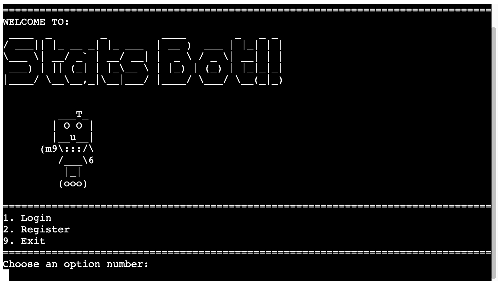

# Support Stats Bot

A command line application to log stats for a customer support team, such as number of tickets solved, live chats handled and CSAT score.

The app includes a login. The data is stored in MongoDB.

[Live webpage](https://support-stats-bot.herokuapp.com/) (using a mock terminal)

## Table of contents

- [Support Stats Bot](#support-stats-bot)
  - [Table of contents](#table-of-contents)
  - [Project Goals](#project-goals)
  - [User experience](#user-experience)
    - [Target audience](#target-audience)
    - [User stories](#user-stories)
      - [Manager/Team lead](#managerteam-lead)
      - [Individual contributor](#individual-contributor)
  - [Structure](#structure)
  - [Features](#features)
    - [1. Welcome banner](#1-welcome-banner)
    - [2. Main menu](#2-main-menu)
    - [3. Login](#3-login)
    - [4. Register](#4-register)
    - [5. Exit](#5-exit)
    - [6. Sub menu](#6-sub-menu)
    - [7. Add/updates stats data](#7-addupdates-stats-data)
    - [8. See support stats (day)](#8-see-support-stats-day)
    - [9. See support stats (week)](#9-see-support-stats-week)
    - [10. Export stats data](#10-export-stats-data)
  - [Technologies used](#technologies-used)
    - [Languages](#languages)
    - [Frameworks and tools](#frameworks-and-tools)
  - [Validation](#validation)
    - [PEP8 validation](#pep8-validation)
    - [Testing user stories](#testing-user-stories)
  - [Bugs](#bugs)
  - [Deployment](#deployment)
  - [Python Libraries](#python-libraries)
    - [pymongo](#pymongo)
    - [tabulate](#tabulate)
    - [certifi](#certifi)
    - [pyfiglet](#pyfiglet)
  - [Credits](#credits)
    - [Code](#code)
    - [Reference material](#reference-material)

## Project Goals

The user goals

- To have a simple and lightweight way to record support team stats.
- To be able to view historical stat summaries.
- To be able to export the stats in other formats for use elsewhere.

The app owner goals

- Provide an easy system for the team to update support team stats.
- Include the ability for managers to see support team stat summaries.
- Make the app easy to navigate.

## User experience

### Target audience

- Managers of customer support teams.
- Team leads of customer support teams.
- Customer support team individual contributors.

### User stories

#### Manager/Team lead

1. As the manager, I want to be able to input stats for future reference.
2. As the manager, I want to be able to view historical stats for a particular day.
3. As the manager, I want to be able to view historical stats for a particular week.
4. As the manager, I want the historical stats to show averages when viewing a date range.
5. As the manager, I want to be able to export the data so I can use my charting software.
6. As the manager, I want a login system to provide some security.

#### Individual contributor

7. As an IC, I don't want to be scared off by the command line.
8. As an IC, I want to be able to find what I need easily.
9. As an IC, I want feedback for when I do something wrong.

## Structure

As a command line app, there isn't a lot of visual design. The menus and information are separated with the help of hyphens and other text-based decoration.

The app relies heavily on user input. There is a main menu and a sub menu once logged in, which require a number input to choose an option. There are also date inputs to choose the correct stat data from the database.

## Features

### 1. Welcome banner

On starting the app, the welcome banner is shown. This displays the title and a robot using ascii art. A friendly introduction.

- User stories: 7

### 2. Main menu

Below the welcome banner is the main menu. This provides the options to login with an existing registered user, register a new user, or exit the app. The user is given a prompt to enter a number to choose an option.

- User stories: 6, 7, 8

### 3. Login

On selecting option 1 from the main menu, the login workflow is triggered. The app asks for a username and password, and provides feedback if anything is entered incorrectly.

- User stories: 6, 9

### 4. Register

On selecting option 2 from the main menu, the register workflow is triggered. The app asks for a username and password, and provides feedback if anything is entered incorrectly.

- User stories: 6, 9

### 5. Exit

On selecting option 9 from either the main menu or the sub menu, the app exits.

### 6. Sub menu

Once registered and logged in, the sub menu appears. This provides the options to enter new stats, view stats for a particular day, view stats for a particular week, or export stats to JSON. The user is given a prompt to enter a number to choose an option.

- User stories: 1, 2, 3, 4, 5, 8

### 7. Add/updates stats data

On selecting option 1 from the sub menu, the user can select a date for entering new data to the database. The app will check to see if the data already exists for the input date, and ask the user if they'd like to overwrite it.

- User stories: 1, 8, 9

### 8. See support stats (day)

On selecting option 2 from the sub menu, the user can select a date to view data for. The app will check if the data exists and display the data in a table for easy reading.

- User stories: 2, 7, 8, 9

### 9. See support stats (week)

On selecting option 3 from the sub menu, the user can select a date to view data for. The app will check if the data exists, automatically work out the week start and end dates, then display the data for that week in a table for easy reading.

- User stories: 3, 4, 7, 8, 9

### 10. Export stats data

On selecting option 4 from the sub menu, the user can select a date range to export data. The app will check if the data exists and export the data to a JSON file.

- User stories: 5, 7, 8, 9

## Technologies used

### Languages

- Python

### Frameworks and tools

Research, planning and wireframes

<ol>
   <li>VSCode (markdown)</li>
   <li>Code Institute lessons/notes</li>
</ol>

Development

<ol>
   <li>Git and GitHub</li>
   <li>VSCode</li>
   <li>Python libraries: pymongo, tabulate, certifi, pyfiglet</li>
</ol>

## Validation

### PEP8 validation

The [PEP8 Online](http://pep8online.com/) site was used to validate the Python of the app.

### Testing user stories

Sorry, I ran out of time to get this done before the submission time.

## Bugs

- BUG: FIXED: $round in the aggregator doesn't seem to work. Used Python instead.
- BUG: FIXED: Entering a number that isn't an option kicks you out of the program, when it should stay on the menu.
- BUG: FIXED: logging in after registering was returning False and kicking out of the program. Added login boolean.
- BUG: FIXED: Enter random string when asking for a date prompts the program to return "Please insert a number:". Added while loop.
- BUG: Typing something other than y/n at y/n questions will kick back to the menu.
- BUG: Registering will also log you in.

## Deployment

The website was deployed using GitHub to Heroku by following these steps:

1. Create an account at [heroku.com](https://.heroku.com/)
2. Create a new app, add app name and your region
3. Click on create app
4. Go to "Settings"
5. Under Config Vars, add your sensitive data (the MongoDB URL for example)
6. For this project, set buildpacks to <Python> and <NodeJS> in that order.
7. Go to "Deploy" and at "Deployment method", click on "Connect to Github"
8. Enter your repository name and click on it.
9. Choose the branch you want to buid your app from, and click "Deploy branch".

You can clone the repository by following these steps:

1. Go to the GitHub repository.
2. Locate the Code button above the list of files and click it.
3. Select if you prefere to clone using HTTPS, SSH, or Github CLI and click the copy button to copy the URL to your clipboard.
4. Open terminal locally.
5. Change the current working directory to the one where you want the cloned directory.
6. Type git clone and paste the URL from the clipboard ($ git clone https://github.com/YOUR-USERNAME/YOUR-REPOSITORY).
7. Press Enter to create your local clone.

## Python Libraries

### pymongo

### tabulate

### certifi

### pyfiglet

## Credits

### Code

- Reference for the menu structure: https://chunkofcode.net/how-to-implement-a-dynamic-command-line-menu-in-python/
- Reference for data classes: https://realpython.com/python-descriptors/

### Reference material

- MongoDB docs: https://www.mongodb.com/blog/post/getting-started-with-python-and-mongodb
- Blog post on security to help with logins: https://martinheinz.dev/blog/59
- Blog post with hashlib: https://medium.com/@moinahmedbgbn/a-basic-login-system-with-python-746a64dc88d6
- Tabulate library for tables https://pypi.org/project/tabulate/
- Docs for setting up MongoDB with Heroku https://www.mongodb.com/developer/how-to/use-atlas-on-heroku/
- Blog post on errors and exceptions https://www.programiz.com/python-programming/exceptions
- Handy StackOverflow post to catch exceptions and see more info https://stackoverflow.com/questions/9823936/python-how-do-i-know-what-type-of-exception-occurred