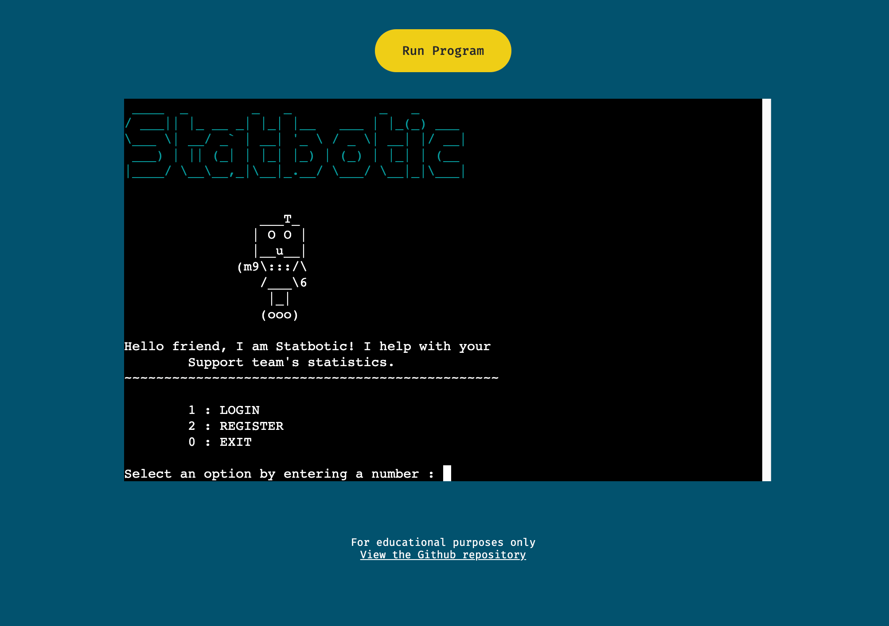

# Statbotic

Statbotic is a command-line Python application for storing, viewing and exporting Support team statistics. To help Support Team Leads and Managers to keep track of how their team is performing.

[Live webpage](https://support-stats-bot.herokuapp.com/)



## Table of contents

- [Statbotic](#statbotic)
  - [Table of contents](#table-of-contents)
- [UX](#ux)
  - [Strategy](#strategy)
    - [The problem](#the-problem)
    - [The solution](#the-solution)
    - [Target audience](#target-audience)
    - [The project goals](#the-project-goals)
  - [Scope](#scope)
    - [User stories](#user-stories)
  - [Structure](#structure)
  - [Skeleton + Surface](#skeleton--surface)
- [Features](#features)
  - [1. Welcome banner](#1-welcome-banner)
  - [2. Login menu](#2-login-menu)
  - [3. Login](#3-login)
  - [4. Register](#4-register)
  - [5. Exit](#5-exit)
  - [6. Main menu](#6-main-menu)
  - [7. Add or update statistics](#7-add-or-update-statistics)
  - [8. View statistics](#8-view-statistics)
  - [9. Export stats](#9-export-stats)
  - [10. Exceptions](#10-exceptions)
- [Testing](#testing)
- [Future enhancements](#future-enhancements)
- [Deployment](#deployment)
  - [Set up MongoDB](#set-up-mongodb)
  - [Connect to MongoDB](#connect-to-mongodb)
  - [Deploy to Heroku using GitHub](#deploy-to-heroku-using-github)
  - [Clone the GitHub repo](#clone-the-github-repo)
- [Technologies used](#technologies-used)
  - [Languages](#languages)
  - [Libraries](#libraries)
  - [Tools](#tools)
- [Credits](#credits)
  - [Code](#code)
  - [Reference material](#reference-material)
- [Acknowledgements](#acknowledgements)

# UX

## Strategy

### The problem

Customer and technical support teams work hard to support their customers and their product. This means that, unless support statistics are being tracked, success or trends can go unnoticed. 

### The solution

Enter Statbotic! A simple, lightweight command-line application. Statistics, such as ticket solves and total live chats, can be stored for future reference. Historical date ranges can be viewed with averages over that range. And statistics can be exported to a JSON file to be used elsewhere - such as chart and graph software.

### Target audience

Myself! I have worked in a technical support team for nearly 5 years. We have always kept track of important statistics to help us to monitor our own, our team's and the overall department's performance. We set targets and compare the real statistics to the targets, then drill into the data if there is a lot of difference, or if any trends start to appear.

We currently have data in two different places: ZenDesk and Intercom. One does a not so great job at providing data access and charts, the other does an excellent job. But they are of course in different places and handle the data very differently. To be able to save both sets of data into a single database, and then export this to a JSON file to be used for charts, is extremely useful to see trends and patterns using the data as a whole.

### The project goals

- To have a simple and lightweight way to record support team stats.
- To be able to view historical stat summaries.
- To be able to export the stats in other formats for use elsewhere.
- To be easy to navigate.

*Go back to the [top](#table-of-contents)*

---

## Scope

### User stories

As a manager/supervisor...

1. I want to input stats to be saved for future reference.
2. I want to view historical stats for a particular date/date range.
3. I want to see averages when viewing saved stats.
4. I want to export the data so I can use my charting software.
5. I want a login to provide some security.
6. I want a friendly application to help command-line be less scary.
7. I want to be able to navigate the application easily.
8. I want feedback on my actions.

## Structure

**App diagram**

The app consists of menus and "forms" (sequences of user input) for gathering information. The rest is "behind the scenes". The diagram below helps to understand how the app has been pieced together.


**Database**

The app uses MongoDB. It's a non-relational database, with data being stored in documents. Each document can store any type of data, regardless of what was saved before, making it very flexible. It also has the perk of storing data in a JSON-like format, making it work really nicely with Python and this project.

## Skeleton + Surface

As a command-line app, there isn't any visual design as such. Space is created by inserting empty lines or clearing the terminal screen. There are also dashed lines to help titles to stand out, and borders for tables. Therefore, no wireframes were used, and no branding/visual design needed.

However, I will note the use of the cheeky robot (see the Features section). Being quite limited as to how to get any personality across with a mostly black and white text-based application, ascii art is an obvious choice. This allowed me to create a more interesting logo, and include a robot illustration.

*Go back to the [top](#table-of-contents)*

---

# Features

## 1. Welcome banner

When arriving on the webpage and the mock terminal first loads, users are welcomed with a coloured logo, a cheeky robot and a welcome message. This provides a friendly introduction to the app, hopefully helping command line to be a slightly less scary place for those that have never used it, and injects some personality into an otherwise text-based application.

User stories: [6](README.md?plain=1#L88)

## 2. Login menu

Beneath the welcome banner is the login menu. Users are given the options login, register or exit, followed by a prompt. Users are required to enter a number to choose a menu option.

User stories: [5](README.md?plain=1#L87), [7](README.md?plain=1#L89)


## 3. Login

On selecting option 1 from the login menu, users enter the login workflow. The app asks for a username and password. The user has 3 tries to get these credentials correct. 

If the username is not found in the database, the app will let the user know and remove a try. If it is found, but the password doesn't match what's stored in the database, the app will again supply feedback to the user and remove a try. When all 3 tries have been used up, the app will return to the login menu.

If the correct credentials are provided, the user is taken to the application's main menu.

User stories: [5](README.md?plain=1#L87)


## 4. Register

On selecting option 2 from the login menu, users enter the registration workflow to create a new login. The app asks for a username, and before continuing, will check if this username already exists in the database. If it does, the app will let the user know and prompt them for another username.

If the username they've chosen does not already exist in the database, the user is asked for a password, which is hashed and stored in the database. After this, they're returned to the login menu to login.

User stories: [5](README.md?plain=1#L87)


## 5. Exit

If the user chooses option 0 from the login menu (or the main menu), the app exits. If this were running in an actual terminal, it would exit the app. But in the mock terminal, it exits, but doesn't appear to do anything, as there's nothing else for it to load.

User stories: [7](README.md?plain=1#L89)

## 6. Main menu

Once a user is logged into the app, they're presented with the main menu where the main activity happens. They again have the option to exit by choosing 0. Or they can choose to add/update stats, view stats, or export stats. There's also a little personalised welcome message showing the user's username. The screenshot shows what happens when you choose to exit.

User stories: [6](README.md?plain=1#L88), [7](README.md?plain=1#L89)


## 7. Add or update statistics

On choosing option 1 from the main menu, the user heads into the add/update stats workflow. The user is asked for a date, which is then checked in the database. If the date already exists, the user is asked if they'd like to overwrite the data. 

If it does not exist, they're taken to a "form" to collect the stats for that date. On completion of the form, the database is updated and the user is asked if they'd like to enter more stats. If the user chooses yes (y), the workflow is restarted. If they choose no (n), the user is returned to the main menu.

User stories: [1](README.md?plain=1#L83)


## 8. View statistics

When the user selects 2 from the main menu, this triggers the workflow for viewing historical statistics (i.e. those that have already been saved in the database). The user is asked for a date again, but this time it represents the beginning of a date range.

The user is then asked for the number of days to be included in the range. To see the statistics just for that date, they can enter 0. The database is checked to see if the data exists. If it does, a table of statistics is then displayed. The table shows totals for the input data, some average calculations for each, and lastly a number of public comments to solved ticket ratio.

It's quick to view the performance of a team using these statistics. The CSAT is the customer satisfaction rating, which is always good to look at over a range of time. The number of comments to solved ticket ratio is important for showing how efficient the team is with their explanations: the more accuracy in their responses, the more likely a ticket will be solved quickly (with less comments). 

In a perfect customer support world, the CSAT score would be 100%, and the comments vs solves ratio would be 1. A good goal would be 95% CSAT and 2 comments per solved ticket.

User stories: [2](README.md?plain=1#L84)


## 9. Export stats

On selecting 3 from the main menu, the user is taken to the export workflow. This starts in the same way as the viewing workflow by asking for a date for the start of the range. This is then followed by an input for the number of extra days. The database is then checked to make sure the data exists. If it does, it's converted and exported to JSON behind the scenes, and the path to the file is provided to the user.

When running this app locally, the JSON files save to the exports/ directory in the root of the folder (as shown below). Sadly, this doesn't work the same on Heroku. If you copy and paste the provided path into the address bar in the browser, Heroku returns a 404. To get this to work properly on Heroku is outside the scope of this project.

User stories: [4](README.md?plain=1#L86)


## 10. Exceptions

Throughout the app, there are descriptive error messages that are displayed to the user should anything not go as planned. There are a few different inputs, such as strings, integers, and strings that need to be in a particular format (dates). Each has their own code that will raise an exception should the input be incorrect and redirect the user accordingly. See the example below.

There are also exceptions in place should anything go wrong with the database connection, or if data cannot be found.

User stories: [8](README.md?plain=1#L90)


*Go back to the [top](#table-of-contents)*

---

# Testing

Please see the [Testing page](TESTING.md) for information on manual testing and validation.

*Go back to the [top](#table-of-contents)*

---

# Future enhancements

Check date ranges - Currently, if there is data missing for days in a date range, the app shows the stats totals and averages for the data that it does have, without the user being aware of the missing data. In other words, it works under the assumption that every day has accurate data entered. It would be good to have the app check if there was data available for every day in a range and inform the user.

Security: Passwords - the passwords are hashed before being stored in the database, meaning that they're secure should anyone get hold of the data. But they're not hashed in the app itself and can be seen when typing them in. 

Security: Restrict users - Add an email requirement to registrations, and limit access to only those who already have an email address saved in the database. Or limit access to only those with a particular domain in their email.

JSON export - Save the JSON files to cloud storage, to allow them to be downloaded or emailed.

Flexible data - allow users to create their own MongoDB collections so they can choose which statistics data they'd like to save.

*Go back to the [top](#table-of-contents)*

---

# Deployment

## Set up MongoDB

1. Head to https://www.mongodb.com/ and click on the "Try free" button in the top-right.
2. Register your details to create an account, then answer the questions on the welcome page and click "Submit".
3. Choose the "Shared" cluster (free). The settings can be left as they are, or tweak them to personal preferences. Click "Create cluster".
4. For the "Security Quickstart", choose a database username and password and click "Create user".
5. Click "Add my current IP address" further down, then click "Finish and Close". Then click on "Go to Databases".
6. Wait for the database to finish creating, then click on "Database Access" in the left menu. Click "Edit" on the database user you created earlier.
7. Leave everything as it is, except for "Database User Privileges". Change the "Built-in Role" to "Atlas admin". Click "Update user".
8. Wait for the changes to complete and the database status to return to active (highlighted with a green dot next to the cluster name).

## Connect to MongoDB

1. Make sure you have Python PyMongo driver installed.
2. From the "Databases" tab, click on "Connect". Choose "Connect your application". Then choose "Python" and "3.4 or later". Copy the connection string.
3. Create a file called mongodbtest.py in the python application. Add the following code, replacing `<connectionstring>` with the one you just copied (make sure the database username and password in the string match the user you created earlier).

```
from pymongo import MongoClient
from pprint import pprint

client = MongoClient(<connectionstring>)
db = client.admin
serverStatusResult=db.command("serverStatus")
pprint(serverStatusResult)
```

4. Run mondodbtest.py. You should see an output that ends with something similar to the following:

```
{
    .
    .
    .
 'storageEngine': {'backupCursorOpen': False,
                   'dropPendingIdents': 0,
                   'name': 'wiredTiger',
                   'oldestRequiredTimestampForCrashRecovery': Timestamp(1641221339, 8),
                   'persistent': True,
                   'readOnly': False,
                   'supportsCommittedReads': True,
                   'supportsPendingDrops': True,
                   'supportsSnapshotReadConcern': True,
                   'supportsTwoPhaseIndexBuild': True},
 'uptime': 16572.0,
 'uptimeEstimate': 16572,
 'uptimeMillis': 16572166,
 'version': '4.4.10'}
```

5. From here, refer to MongoDB's documentation on [Atlas](https://docs.atlas.mongodb.com/) and [PyMongo](https://docs.mongodb.com/drivers/pymongo/).

## Deploy to Heroku using GitHub

1. Create an account at [heroku.com](https://.heroku.com/).
2. Create a new app, add app name and your region.
3. Click on create app.
4. Go to "Settings".
5. Under Config Vars, add your sensitive data (the MongoDB URL for example).
6. For this project, set buildpacks to <Python> and <NodeJS> in that order.
7. Go to "Deploy" and at "Deployment method", click on "Connect to Github".
8. Enter your repository name and click on it.
9. Choose the branch you want to buid your app from, and click "Deploy branch".

## Clone the GitHub repo

1. Go to the GitHub repository.
2. Locate the Code button above the list of files and click it.
3. Select if you prefere to clone using HTTPS, SSH, or Github CLI and click the copy button to copy the URL to your clipboard.
4. Open terminal locally.
5. Change the current working directory to the one where you want the cloned directory.
6. Type git clone and paste the URL from the clipboard ($ git clone https://github.com/YOUR-USERNAME/YOUR-REPOSITORY).
7. Press Enter to create your local clone.

*Go back to the [top](#table-of-contents)*

---

# Technologies used

## Languages

- Python
- A little HTML/CSS

## Libraries

| **Library** | **Used for** |
|--|--|
| [certifi](https://pypi.org/project/certifi/) | Connecting securely to MongoDB Atlas |
| [clint](https://pypi.org/project/clint/) | The colour in the "logo" |
| [pyfiglet](https://github.com/pwaller/pyfiglet) | Creating ascii art text |
| [pymongo](https://pypi.org/project/pymongo/) | MongoDB specific interactions |
| [tabulate](https://pypi.org/project/tabulate/) | Pretty printing tables of data |

## Tools

- Git/GitHub
- Heroku
- MongoDB

*Go back to the [top](#table-of-contents)*

---

# Credits

## Code

- Reference for the menu structure: https://chunkofcode.net/how-to-implement-a-dynamic-command-line-menu-in-python/
- Reference for data classes: https://realpython.com/python-descriptors/

## Reference material

- MongoDB docs: https://www.mongodb.com/blog/post/getting-started-with-python-and-mongodb
- Blog post on security to help with logins: https://martinheinz.dev/blog/59
- Blog post with hashlib: https://medium.com/@moinahmedbgbn/a-basic-login-system-with-python-746a64dc88d6
- Tabulate library for tables https://pypi.org/project/tabulate/
- Docs for setting up MongoDB with Heroku https://www.mongodb.com/developer/how-to/use-atlas-on-heroku/
- Blog post on errors and exceptions https://www.programiz.com/python-programming/exceptions
- Handy StackOverflow post to catch exceptions and see more info https://stackoverflow.com/questions/9823936/python-how-do-i-know-what-type-of-exception-occurred

*Go back to the [top](#table-of-contents)*

---

# Acknowledgements

I would like to take the opportunity to thank:

- My family, friends and colleagues for their advice, support and help with testing.
- My mentor for their feedback, advice and support.

*Go back to the [top](#table-of-contents)*