# Statbotic Testing

- [Statbotic Testing](#statbotic-testing)
  - [HTML validation](#html-validation)
  - [CSS validation](#css-validation)
  - [PEP8 validation](#pep8-validation)
  - [Testing user stories](#testing-user-stories)
    - [As a manager/supervisor, I can...](#as-a-managersupervisor-i-can)
  - [Bugs](#bugs)

The project was tested continuosly throughout development by running the app multiple times between code changes. This was to test the output from the bot, exceptions being raised correctly and the spacing/clearing of the output. I used extra code to produce more verbose exceptions to help me to catch every error, which was then removed once the workflow had been thoroughly tested. Further [user story testing](#testing-user-stories) was also completed.

## HTML validation

The [W3C Markup Validation Service](https://validator.w3.org/) was used to validate the HTML of the website. Most of the HTML was provided for me as part of the Code Institute template for this project, with a few tweaks made to update the styling.

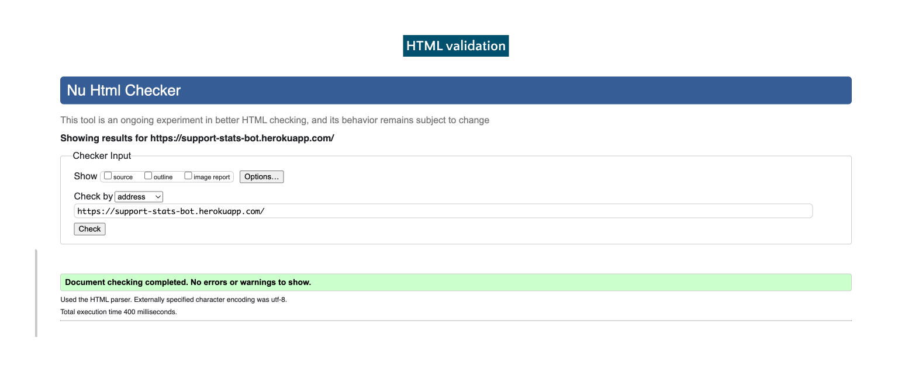

## CSS validation

The [W3C Jigsaw CSS Validation Service](https://jigsaw.w3.org/css-validator/validator) was used to validate the CSS of the website. The CSS passes with 0 errors. There are 2 warnings due to the provided code in the project template.

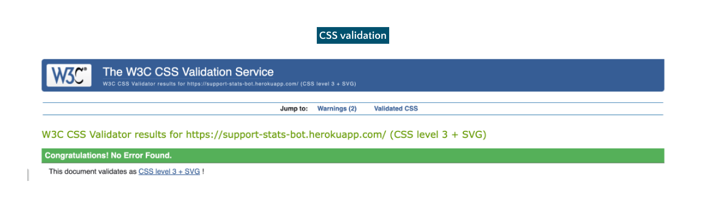

## PEP8 validation

[PEP8 Online](http://pep8online.com) was used to validate the Python code on the site. No errors were flagged in any of the Python files.

run.py

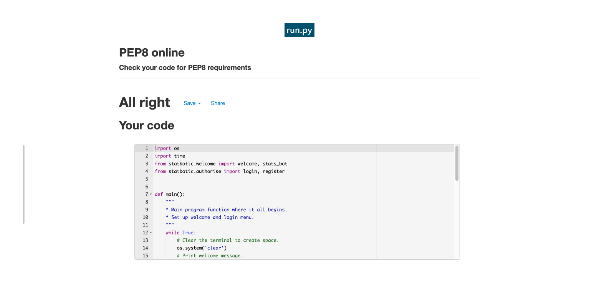

app.py

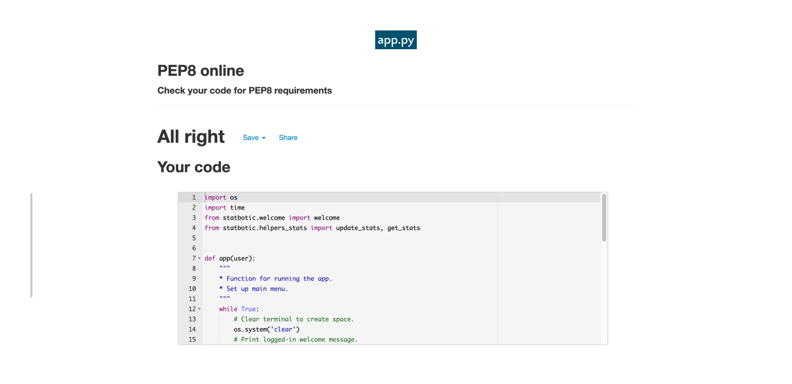

authorise.py

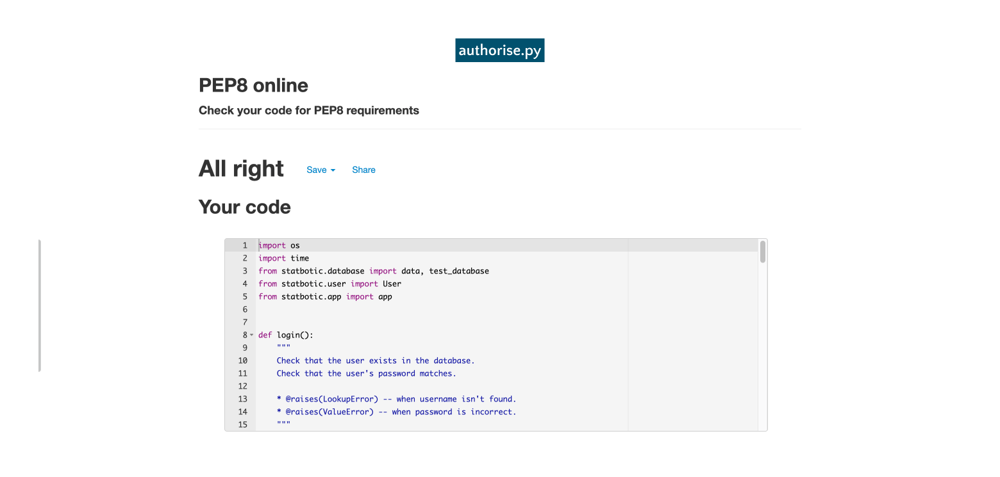

database.py

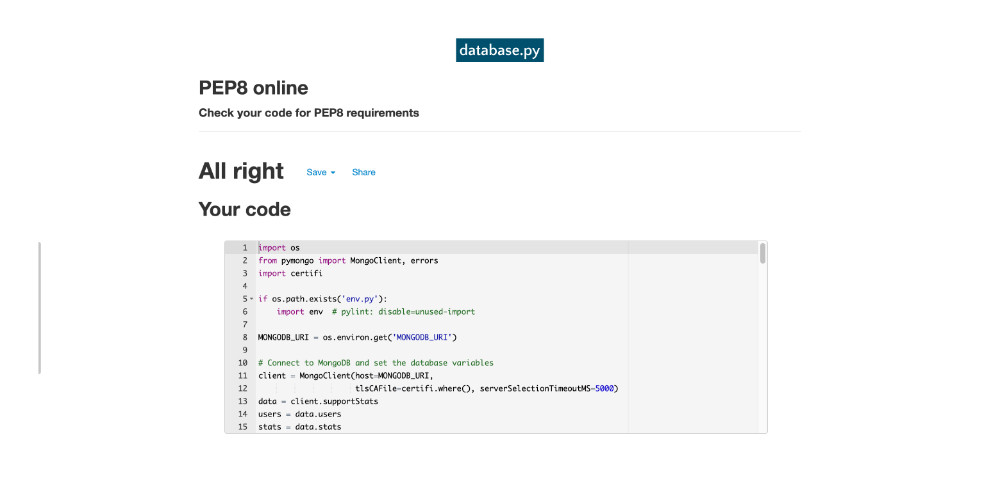

date.py

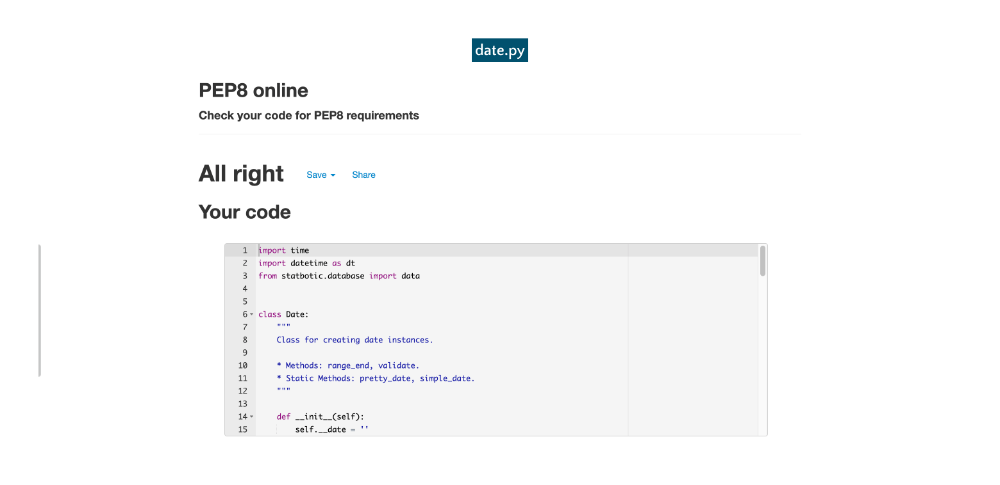

helpers_stats.py

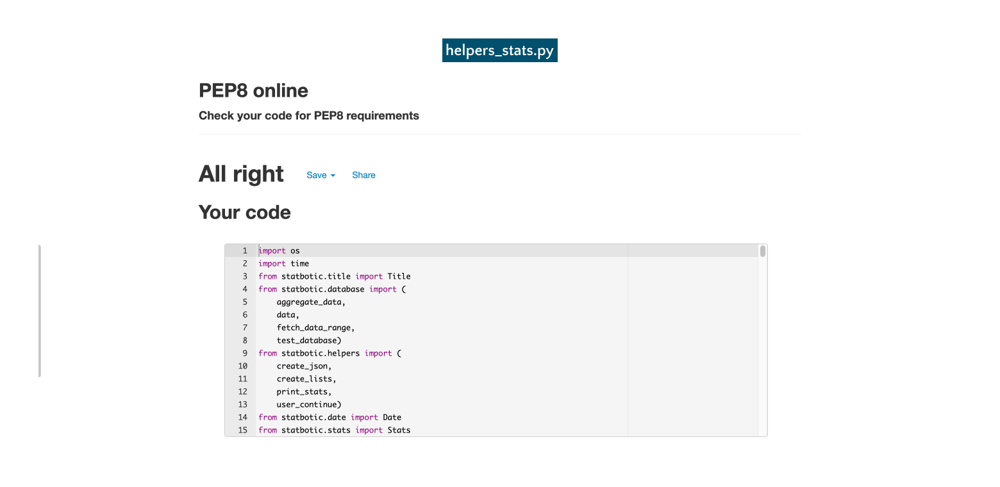

helpers.py

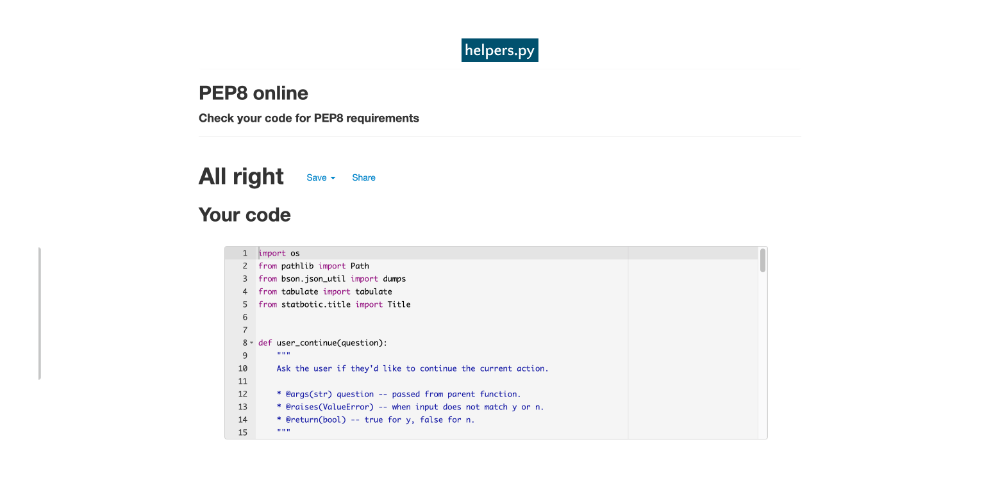

stats.py

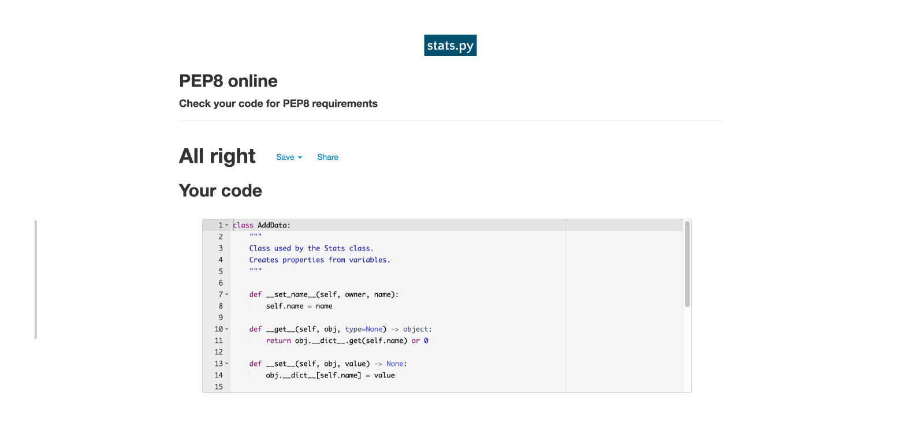

title.py

user.py

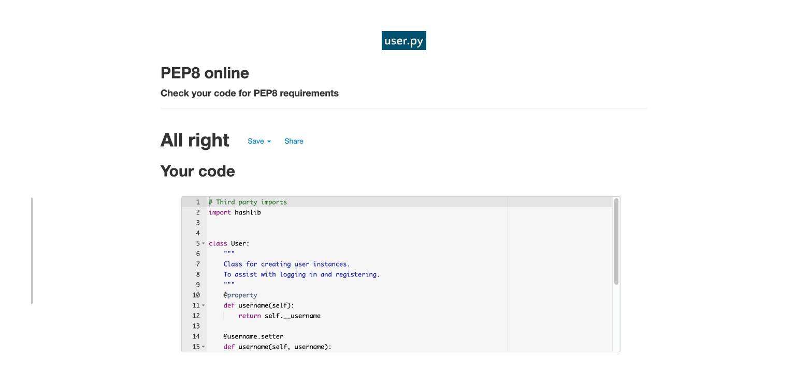

welcome.py

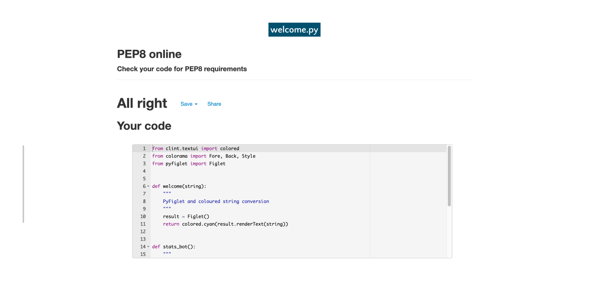

## Testing user stories

### As a manager/supervisor, I can...

US1: **...input stats to be saved for future reference.**

| **Feature** | **Acceptance criteria** | **Test** | **Result** |
|:--|:--|:--|:--:|
| [F7](README.md#7-add-or-update-statistics) | The user should be able to input statistics and see that they are saved to the database. | - Navigate to the menu option - Input stats data - See confirmation message - View stats to ensure it was saved |:white_check_mark:|

US2: **...view historical stats for a particular date/date range.**
US3: **...see averages when viewing saved stats.**

| **Feature** | **Acceptance criteria** | **Test** | **Result** |
|:--|:--|:--|:--:|
| [F8](README.md#8-view-statistics) | The user should be able to choose a date/date range to view historical data from the database, along with averages. | - Navigate to the menu option - Enter a date range - See displayed stats - See averages |:white_check_mark:|

US4: **...export the data so I can use my charting software.**

| **Feature** | **Acceptance criteria** | **Test** | **Result** |
|:--|:--|:--|:--:|
| [F9](README.md#9-export-stats) | The user should be able to save and export data to a JSON file[^1]. | - Navigate to the menu option - Enter a date range - See confirmation message and file path |:white_check_mark:|

[^1]: The file appears not to exist on Heroku due to the [ephemeral file system](https://help.heroku.com/K1PPS2WM/why-are-my-file-uploads-missing-deleted-from-the-application). This works locally.

US5: **...login to provide some security.**

| **Feature** | **Acceptance criteria** | **Test** | **Result** |
|:--|:--|:--|:--:|
| [F2](README.md#2-login-menu) [F3](README.md#3-login) [F4](README.md#4-register) | The user should be able to create login credentials and then login to see the main app. | - Choose register from login menu - Create a new user - Choose login from login menu - Login and see main menu |:white_check_mark:|

US6: **...see a friendly application to help command-line be less scary.**

| **Feature** | **Acceptance criteria** | **Test** | **Result** |
|:--|:--|:--|:--:|
| [F1](README.md#1-welcome-banner) [F6](README.md#6-main-menu) | The user should feel less anxious with the help of natural language and ascii art. | - Use the app - Observe spacing and ascii art - Read app output |:white_check_mark:|

US7: **...navigate the application easily.**

| **Feature** | **Acceptance criteria** | **Test** | **Result** |
|:--|:--|:--|:--:|
| [F2](README.md#2-login-menu) [F6](README.md#6-main-menu) [F5](README.md#5-exit) | The user should be able to move around the app easily. | - Use the app - Try all the menu options |:white_check_mark:|

US8: **...see feedback on my actions.**

| **Feature** | **Acceptance criteria** | **Test** | **Result** |
|:--|:--|:--|:--:|
| [F10](README.md#10-exceptions) | The user should see feedback if an incorrect input is used or data is/is not found, etc. | - Use the app - Test every feature while deliberately trying to break it - See relevant error messages and loops |:white_check_mark:|

## Bugs

- BUG: FIXED: $round in the aggregator doesn't seem to work. Used Python instead.
- BUG: FIXED: Entering a number that isn't an option kicks you out of the program, when it should stay on the menu.
- BUG: FIXED: logging in after registering was returning False and kicking out of the program. Added login boolean.
- BUG: FIXED: Enter random string when asking for a date prompts the program to return "Please insert a number:". Added while loop.
- BUG: Typing something other than y/n at y/n questions will kick back to the menu.
- BUG: Registering will also log you in.