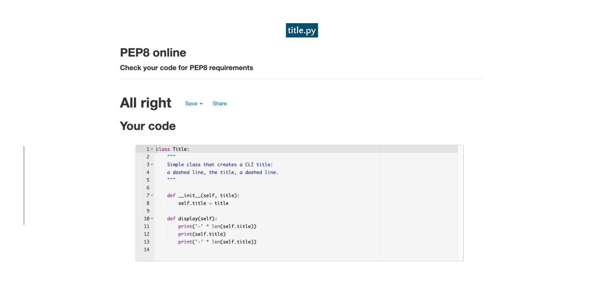

# Statbotic Testing

- [Statbotic Testing](#statbotic-testing)
  - [HTML validation](#html-validation)
  - [CSS validation](#css-validation)
  - [PEP8 validation](#pep8-validation)
  - [Testing user stories](#testing-user-stories)
  - [Notable Bugs](#notable-bugs)

The project was tested continuosly throughout development by running the app multiple times between code changes. This was to test the output from the bot, exceptions being raised correctly and the spacing/clearing of the output. I used extra code to produce more verbose exceptions to help me to catch every error, which was then removed once the workflow had been thoroughly tested. Further [user story testing](#testing-user-stories) was also completed.

## HTML validation

The [W3C Markup Validation Service](https://validator.w3.org/) was used to validate the HTML of the website. Most of the HTML was provided for me as part of the Code Institute template for this project, with a few tweaks made to update the styling.

*Go back to the [top](#table-of-contents)*

---

## CSS validation

The [W3C Jigsaw CSS Validation Service](https://jigsaw.w3.org/css-validator/validator) was used to validate the CSS of the website. The CSS passes with 0 errors. There are 2 warnings due to the provided code in the project template.

*Go back to the [top](#table-of-contents)*

---

## PEP8 validation

[PEP8 Online](http://pep8online.com) was used to validate the Python code on the site. No errors were flagged in any of the Python files.

run.py

app.py

authorise.py

database.py

date.py

helpers_stats.py

helpers.py

stats.py

title.py

user.py

welcome.py

*Go back to the [top](#table-of-contents)*

---

## Testing user stories

[User Story 1](README.md?plain=1#L83)

The user should be able to input statistics and see that they are saved to the database.

Features: [F3](README.md#3-login), [F7](README.md#7-add-or-update-statistics)

| **Pass** | **Actions** |
|:--:|--|
| :white_check_mark: | Log into the app |
| :white_check_mark: | Navigate to the add/update stats menu option |
| :white_check_mark: | Input stats as required |
| :white_check_mark: | See confirmation message |
| :white_check_mark: | Test viewing the stats to ensure they're saved |

[User Story 2](README.md?plain=1#L84) & [User Story 3](README.md?plain=1#L85)

The user should be able to choose a date/date range to view historical data from the database, along with averages.

Features: [F3](README.md#3-login), [F8](README.md#8-view-statistics)

| **Pass** | **Actions** |
|:--:|--|
| :white_check_mark: | Log into the app |
| :white_check_mark: | Navigate to the view stats menu option |
| :white_check_mark: | Enter a date range |
| :white_check_mark: | See displayed stats for supplied date range |
| :white_check_mark: | See averages for supplied date range |

[User Story 4](README.md?plain=1#L86)

The user should be able to save and export data to a JSON file[^1].

Features: [F3](README.md#3-login), [F9](README.md#9-export-stats)

| **Pass** | **Actions** |
|:--:|--|
| :white_check_mark: | Log into the app |
| :white_check_mark: | Navigate to the export stats menu option |
| :white_check_mark: | Enter a date range |
| :white_check_mark: | See confirmation message and file path |
| :white_check_mark: | (If local) Go to file path and see saved JSON file |

[^1]: The file appears not to exist on Heroku due to the [ephemeral file system](https://help.heroku.com/K1PPS2WM/why-are-my-file-uploads-missing-deleted-from-the-application). This works locally.

[User Story 5](README.md?plain=1#L87)

The user should be able to create login credentials and then login to see the main app.

Features: [F2](README.md#2-login-menu), [F3](README.md#3-login), [F4](README.md#4-register)

| **Pass** | **Actions** |
|:--:|--|
| :white_check_mark: | Navigate to the register menu option |
| :white_check_mark: | Enter a username |
| :white_check_mark: | Enter a password |
| :white_check_mark: | Return to the login menu |
| :white_check_mark: | Navigate to the login menu option |
| :white_check_mark: | Enter same username and password |
| :white_check_mark: | See main app menu |

[User Story 6](README.md?plain=1#L88)

The user should feel less anxious with the help of natural language and ascii art.

Features: [F1](README.md#1-welcome-banner), [F6](README.md#6-main-menu)

| **Pass** | **Actions** |
|:--:|--|
| :white_check_mark: | Open the app to see ascii (coloured) logo and robot |
| :white_check_mark: | Read welcome from app |
| :white_check_mark: | Read comments from app throughout the workflows |
| :white_check_mark: | See the personalised welcome on the main menu |

[User Story 7](README.md?plain=1#L89)

The user should be able to move around the app easily.

Features: [F2](README.md#2-login-menu), [F6](README.md#6-main-menu), [F5](README.md#5-exit)

| **Pass** | **Actions** |
|:--:|--|
| :white_check_mark: | Open the app |
| :white_check_mark: | Try all of the menu options |
| :white_check_mark: | Read all app messaging to check it makes sense |

[User Story 8](README.md?plain=1#L90)

The user should see feedback if an incorrect input is used or data is/is not found, etc.

Features: [F10](README.md#10-exceptions)

| **Pass** | **Actions** |
|:--:|--|
| :white_check_mark: | Test every feature, deliberately trying to break the app |
| :white_check_mark: | See relevant error messages and sensible app response |

## Notable Bugs

My first version (Jan 2022) of this project ran into a number of issues with the menu system in particular. These are the bugs related to that. These were all rendered irrelevant by replacing the menus with much simpler code in my second version (Jun 2022).

- Entering a number that isn't an option kicks you out of the program, when it should stay on the menu.
- Logging in after registering was returning False and kicking out of the program.
- Enter random string when asking for a date prompts the program to return "Please insert a number:".
- Typing something other than y/n at y/n questions will kick back to the menu.
- Registering will also log you in.

The menu system in the first version relied on too many booleans, making for a confusing structure and bugs that were tricky to catch and fix. The second version separates the code into more files, breaking up the workflows, simplifying the menu system, and making a much more robust app.

These are the notable bugs from V1 and V2:

| **Resolved** | **Bug** | **Fix** |
|:--:|--|--|
| :white_check_mark: | $round in the MongoDB aggregator doesn't work | Remove it and use Python instead (V1) |
| :white_check_mark: | Unbound errors when trying to run app | Rename variables to avoid conflict - [commit](https://github.com/lucywoodman/stats-bot/commit/b2807f7a01e54cbdedef7f9801dd5c38e42002f2)|
| :white_check_mark: | Date input validation not working | Add try/except with exception message - [commit](https://github.com/lucywoodman/stats-bot/commit/13bf0abc307484c0a196730809ea697f69017ea2)|
| :white_check_mark: | Incorrect message seen before screen cleared when returning to menus | Add an else to menu loops - [commit](https://github.com/lucywoodman/stats-bot/commit/13c5fac263bc61ae012b5a291df541eef9067b0f)|
| :white_check_mark: | Catchall exception raised when a non-integer is entered for stats | Add a ValueError exception with better messaging - [commit](https://github.com/lucywoodman/stats-bot/commit/451d06ef8ed3e975a78d6274c484771a0ad38407)|
